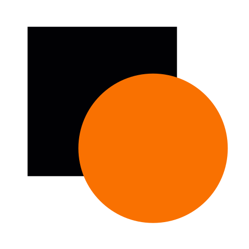
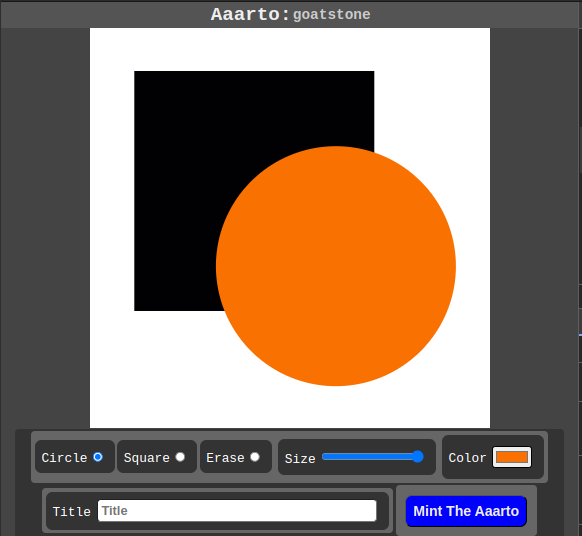
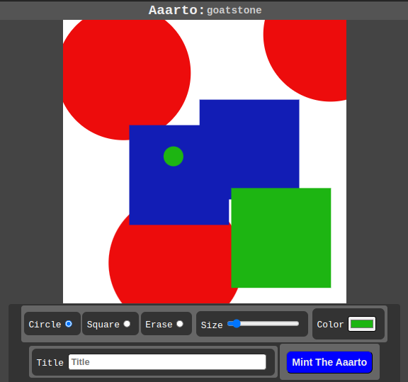

# Aaarto   



### Aaarto is online at: [https://aaarto.art/](https://aaarto.art/)

Aaarto is an online drawing program that enables the minting of the artwork as a Non-fungible token, an NFT.

The drawing application aspect of Aaarto enables the creation of art by the adding of circles and squares of various sizes and colors onto a canvas area. Tools to set the shapes' size and color are offered to the user. An erase tool enables the deletion of the shapes applied to the canvas. There is a text area in which the user can give the artwork a name.

At any point in the creation of the art, the user can create an NFT of the art.

With the Aaarto program, the process of creating the art and the characteristics of the NFT are tightly connected. The characteristics of the NFT are controlled by a single creation mechanism. Not just any digital asset is minted. The connection between the creation process and the NFT overcomes the generality of the uploading of any digital data. 

The artwork generated by Aaarto is in the SVG format. SVG data is stored as tags (tags that give information about the content of the file). This data gives insight into the content of the artwork. This insight into the content and structure of the artwork is preferable to a series of pixels. A series of pixel data has no inherent way of indicating what the content of the artwork is.

## An example of the content of an SVG file

```
<svg version="1.1" width="300" height="300" xmlns="http://www.w3.org/2000/svg">
    <rect width="100%" height="100%" fill="gray" />
    <circle cx="150" cy="100" r="80" fill="green" />
</svg>
```

## User Journey

- On the initial view of Aaarto, the user is presented with a blank canvas and tools for selecting squares and circles that can be applied to the canvas. The user is offered tools to control the color and size of the shapes applied. The user can also remove the shapes. There is a text box in which the user can optionally name the artwork. This drawing application is simple, yet, the artwork that can be created is infinite. 

- A button with the label "Mint the Aaarto" is present. While the user is creating the art, they can, at any time, choose to mint the Aaarto as a Non-fungible token.

- If the user presses the "Mint the Aaarto" button the application will connect with the user's wallet. The application will notify the user if they need to install MetaMask or if they need to connect the wallet to the application.

- During the minting process, the application will upload the artwork to a pinning service that will load the SVG art onto the Interplanetary File System, IPFS. Once the files are loaded to the IPFS the user is presented with a MetaMask dialog that will ask for confirmation of the minting of the NFT. The fees associated with the minting will be a gas fee and a platform fee.
 
- Once the user approves the minting, the NFT will be saved to the user's wallet and can be viewed on the website OpenSea.

## Future Roadmap

The key concept of linking the creation program to the minting can be scaled to other styles of art. A system that is based on the styles of the painter Mondrian could be developed. 

## The Technologies Used
Hardhat, TypeScript, JavaScript, HTML, SVG, CSS, Solidity, OpenZeppelin, Pinata, Node

### Aaarto is designed and developed by Jose Collas. 

Jose is a full-stack web developer, specializing in client-side and data visualization
development with JavaScript, CSS, SVG, and HTML. He is adept at balancing design and
development to create seamless user experiences. He is passionate about crafting impactful and efficient web applications.


