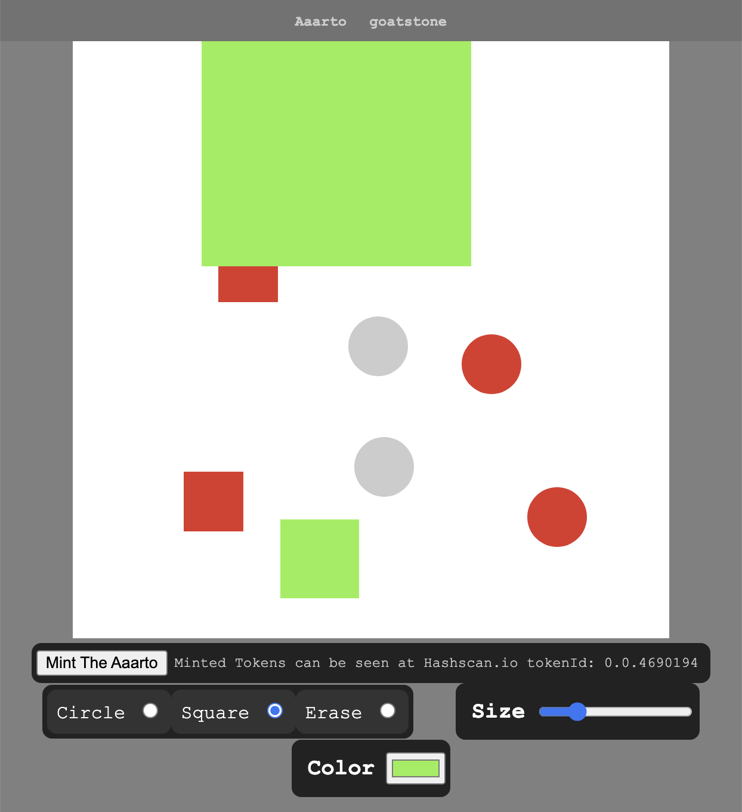
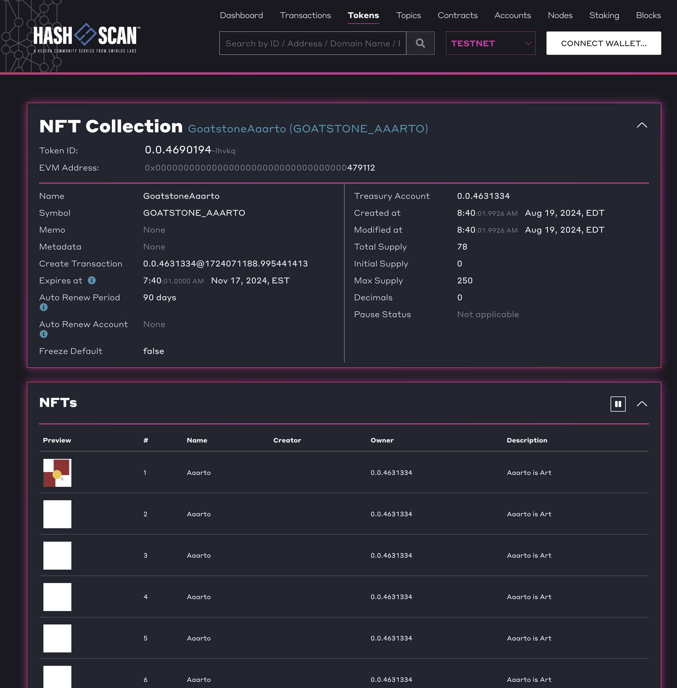
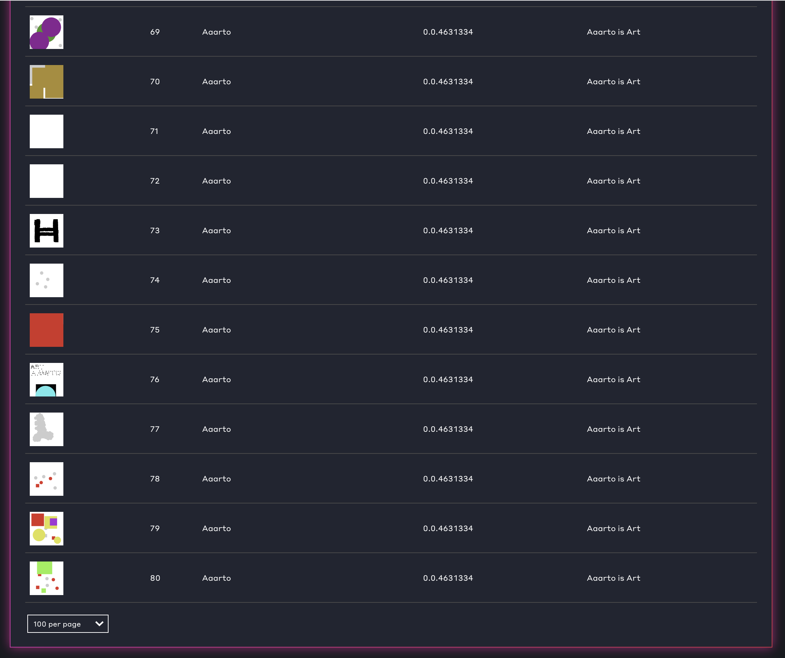

# Aaarto



Aaarto is online at:
<a href="https://joseherminiocollas.github.io/aaarto/" target="new">https://joseherminiocollas.github.io/aaarto/<a>

Aaarto is an online drawing program that enables the minting of art work as an NFT on the Hedera network. 

The drawing application part of Aaarto enables the creation of art by the placing of circles and squares of various sizes and colors onto a canvas area. 

At any point in the creation of the art, the user can create an NFT of the art.

With the Aaarto program, the process of creating the art and the characteristics of the NFT are tightly connected. The characteristics of NFT are controlled by a single creation mechanism. Not just any digital asset is minted. The connection between the creation process and the NFT overcomes the generality of the uploading of digital data. The artwork generated by Aaarto is in the SVG format. SVG data is stored as SVG tags. This data gives insight into the content of the artwork. This insight into the structure of the artwork is preferable to a series of pixels. A series of pixel data has no inherent way of indicating what the content of the artwork is.   

## User Journey

- On initial view of the application, the user is presented with a screen that prompts the user to open their crypto wallet. The application Aaarto will connect with the users' wallet.
- Once the wallet is open, the user is presented with a drawing application. This drawing application is simple. It offers brushes in the shape of squares and circles. Tools to set the shapes' sizes and colors are offered to the user. An erase tool is offered to enable the deletion of the shapes applied to the canvas.


- The user can draw images with the application and at any time select the "Create NFT" button to mint the image as an NFT.
- Once the user initiates the minting, they are prompted for the name of the artwork. When all required data is supplied, the user is presented with a button "Create" that will enable the creation of the artwork as an NFT.
- The NFT will be saved to the users' wallet.
- The token will be visible on Hashscan




## Future Roadmap

The key concept of linking the creation program to the minting can be scaled to other styles of art. A system that is based on the styles of the painter Mondrian could be developed. The wallet needs to be linked to the application to enable real transactions. Aaarto coin to trade Aaarto art with.

## The crypto folder has code for creating and minting NFTs

### Create/Define a Token

Use runTokenCreate to create the definition of a Token that will enable minting of the the defined token.

```
node crypto/runTokenCreate.js TOKEN_NAME, TOKEN_SYMBOL
```

### Mint an Aaarto NFT
```
mintArt('The art to mint in SVG')
```
 	
## Stack
Hedera SDK, Pinata, Node, JavaScript, HTML, SVG, CSS

This project is done in the context of the Hello Future Hackathon [https://hedera.com/](https://hedera.com/)

Aaarto was designed and developed by Jose Collas. Jose has a long history of web development and has a deep interest in crypto.
